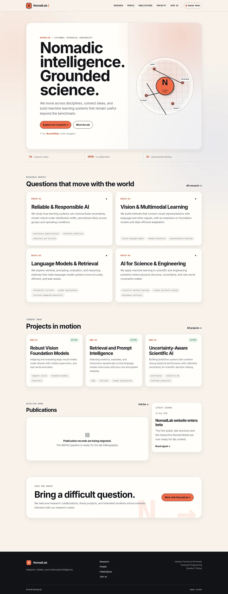
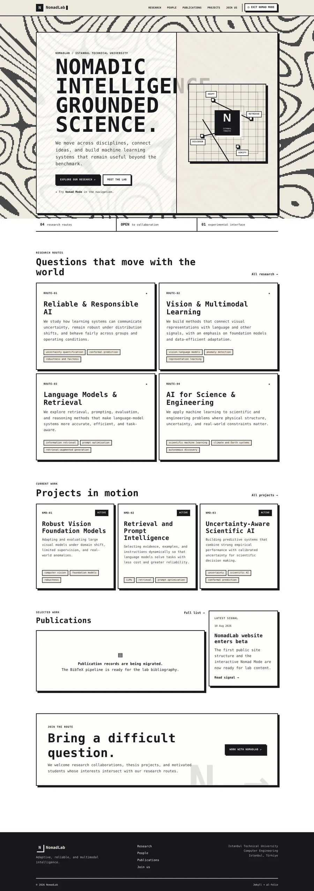

# NomadLab website

NomadLab için hazırlanmış, veri odaklı bir akademik laboratuvar sitesi. Jekyll ve al-folio yayın altyapısını kullanır; buna bağımsız olarak geliştirilen **Nomad Mode** arayüzü eklenmiştir.

## Görsel önizleme

| Normal akademik görünüm | Nomad Mode |
|---|---|
|  |  |

## Hazır gelen özellikler

- Home, People, Research, Publications, Projects, Join Us ve özel 404 sayfası.
- Kişiler, araştırma alanları, projeler ve haberler için YAML tabanlı içerik yönetimi.
- `jekyll-scholar` üzerinden BibTeX tabanlı yayın yönetimi.
- Responsive normal, light/dark ve deneysel Nomad Mode görünümleri.
- Altı adet iki renkli Nomad paleti, piksel tipografi ve keskin yüksek kontrastlı bileşenler.
- Düşük çözünürlüklü, hareketli Turing-benzeri prosedürel arka plan.
- WebGL renderer; WebGL kullanılamazsa Canvas 2D, o da kullanılamazsa CSS fallback.
- `prefers-reduced-motion`, görünürlükte duraklatma, resize/orientation desteği ve kalıcı kullanıcı tercihi.
- GitHub Actions üzerinden doğrudan GitHub Pages dağıtımı.

## İlk yayınlamadan önce

`_config.yml` içinde en az şu alanları kontrol edin:

```yaml
url: https://YOUR-GITHUB-USERNAME.github.io
baseurl:
contact_email: sahinyu@itu.edu.tr
```

Kullanıcı veya organizasyon ana sitesi için depo adı `YOUR-GITHUB-USERNAME.github.io` ise `baseurl` boş kalır.

Site bir proje deposundan, örneğin `YOUR-GITHUB-USERNAME.github.io/NomadLab` adresinden yayınlanacaksa:

```yaml
url: https://YOUR-GITHUB-USERNAME.github.io
baseurl: /NomadLab
```

Dağıtım iş akışı GitHub Pages'in verdiği base path değerini build sırasında kullanır. Buna rağmen canonical ve sosyal metadata için `url` alanının doğru yazılması gerekir.

## GitHub Pages'e yayınlama

1. Yeni bir GitHub deposu oluşturup bu klasörün içeriğini yükleyin.
2. `main` dalına commit ve push yapın.
3. Depoda **Settings → Pages** bölümünü açın.
4. **Source** alanını **GitHub Actions** olarak seçin.
5. **Actions → Deploy NomadLab to GitHub Pages** iş akışını çalıştırın veya yeni bir commit gönderin.

İş akışı `.github/workflows/deploy.yml` dosyasındadır.

## İçerik dosyaları

| İçerik | Dosya |
|---|---|
| Lab sloganı ve kısa açıklama | `_data/site.yml` |
| Kişiler ve ekip grupları | `_data/people.yml` |
| Araştırma rotaları | `_data/research.yml` |
| Projeler / research directions | `_data/projects.yml` |
| Ana sayfa duyurusu | `_data/news.yml` |
| Yayınlar | `_bibliography/papers.bib` |
| Ana sayfa kompozisyonu | `_layouts/lab-home.liquid` |
| Başvuru metni | `_pages/join.md` |
| URL, iletişim ve site metadata | `_config.yml` |

### Kişi ekleme

`_data/people.yml` içinde uygun grubun `members` listesine kayıt ekleyin:

```yaml
- name: Student Name
  initials: SN
  role: MSc Researcher
  affiliation: Istanbul Technical University
  bio: A one- or two-sentence research description.
  image: people/student-name.jpg
  image_alt: Portrait of Student Name
  interests:
    - multimodal learning
    - reliable AI
  email: student@itu.edu.tr
  homepage: https://example.com
  scholar: https://scholar.google.com/...
  github: https://github.com/...
  linkedin: https://www.linkedin.com/in/...
```

Portreleri `assets/img/people/` dizinine yerleştirin. `image` verilmezse kart baş harfleri gösterir. Başlangıçta bulunan Yusuf Hüseyin Şahin görseli gerçek fotoğraf değil, soyut bir yer tutucu grafiktir.

Yeni kategori eklemek için `groups` altında yeni nesne oluşturun:

```yaml
- id: graduate-researchers
  title: Graduate Researchers
  description: MSc and PhD researchers.
  members:
    - name: Student Name
      initials: SN
      role: PhD Candidate
```

### Yayın ekleme

1. Doğrulanmış BibTeX kayıtlarını `_bibliography/papers.bib` içine ekleyin.
2. İsteğe bağlı al-folio alanları arasında `selected`, `pdf`, `code`, `website`, `abstract` ve `bibtex_show` bulunur.
3. Yerel PDF'leri `assets/pdf/`, yayın görsellerini `assets/img/publication_preview/` altında tutun.
4. `_config.yml` içinde şunu değiştirin:

```yaml
nomadlab:
  publications_ready: true
```

Bundan sonra Publications sayfası kayıtları yıla göre gruplar ve bibliyografya aramasını açar. `selected={true}` işaretli yayınlar ana sayfada gösterilebilir.

## Nomad Mode kontrolleri

- **Nomad Mode** düğmesi modu açıp kapatır.
- `Alt + N` aynı işlemi klavyeden yapar.
- Mod açıkken `Shift` basılı tutup düğmeye tıklamak veya `Alt + P` paleti değiştirir.
- Mod ve palet seçimi `localStorage` içinde saklanır.
- Hareket azaltma tercihi açık olan kullanıcılara sürekli animasyon yerine sabit bir prosedürel kare gösterilir.

Ana dosyalar:

- `assets/js/nomad-mode.js` — durum, palet, erişilebilirlik ve saklama mantığı.
- `assets/js/turing-background.js` — WebGL shader ve Canvas fallback.
- `_sass/_nomadlab.scss` — normal arayüz ve Nomad Mode görsel sistemi.
- `_includes/nomad-background.liquid` — tam ekran canvas katmanı.
- `_includes/header.liquid` — mod düğmesi ve navigasyon.

Paletler:

```text
ember · signal · matrix · polar · orchid · chalk
```

## Yerel geliştirme

`.ruby-version` Ruby 3.3.5'i seçer.

```bash
bundle install
bundle exec jekyll serve --livereload
```

Jekyll'in yazdırdığı yerel adresi açın; çoğu kurulumda bu adres `http://127.0.0.1:4000` olur.

Production build:

```bash
JEKYLL_ENV=production bundle exec jekyll build
```

## Son kontrol listesi

- [ ] `_config.yml` içindeki GitHub Pages URL'si doğru.
- [ ] Gerçek lab üyeleri `_data/people.yml` içine eklendi.
- [ ] Soyut PI yer tutucusu onaylı fotoğraf veya grafikle değiştirildi.
- [ ] `_bibliography/papers.bib` doğrulanmış yayınlarla dolduruldu.
- [ ] `publications_ready: true` yapıldı.
- [ ] 1200×630 sosyal paylaşım görseli eklenip `og_image` ayarlandı.
- [ ] Join Us metni ve başvuru kanalı onaylandı.
- [ ] Masaüstü ve mobil dağıtım kontrol edildi.

## Lisans ve provenance

- Referans akademik yapı MIT lisanslı **al-folio** temasına dayanır; lisans `LICENSE` içinde korunur.
- Font binary'leri bu depoya gömülmemiştir; metin ve ikon stilleri upstream CDN kaynaklarından yüklenir.
- Turing-benzeri alan, bu proje için yazılmış bağımsız bir WebGL/Canvas uygulamasıdır; referans sitedeki derlenmiş Next.js chunk'ları kopyalanmamıştır.
- Ayrıntılı atıf ve provenance bilgisi `NOTICE.md` içindedir.
